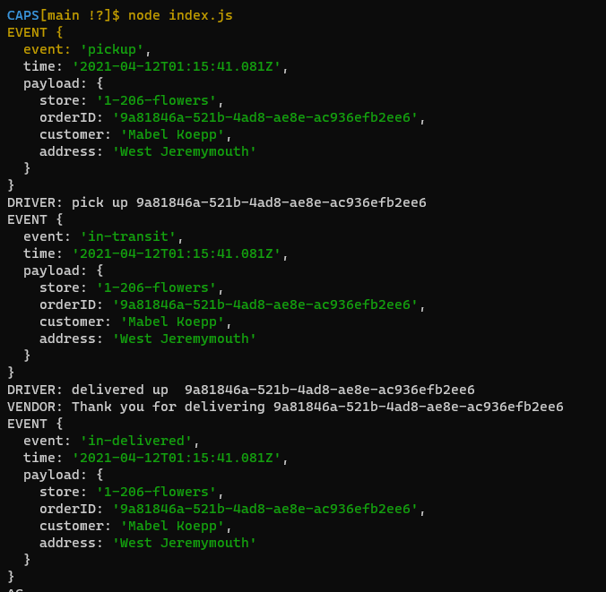

# CAPS
LAB - 11 - Build Event Driven Applications

## Setup

## Install

Clone the Repo .  
Run the command npm i dotenv faker  (dependencies)  
.env requirements   
  * STORENAME=1-206-flowers    

## Running the app

npm start

